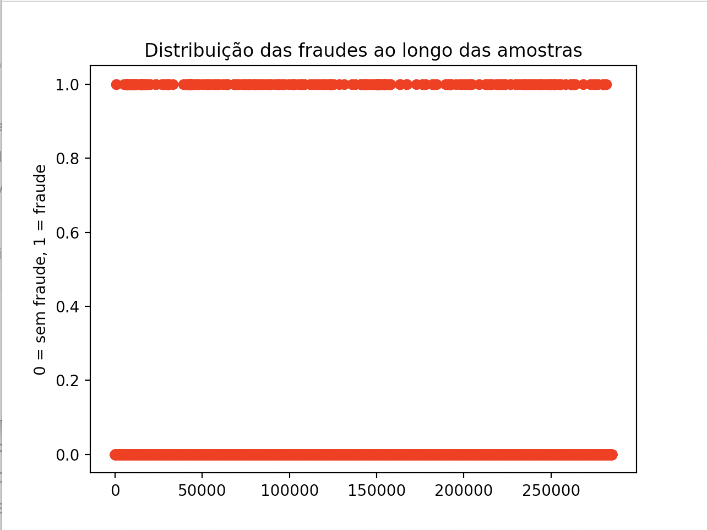
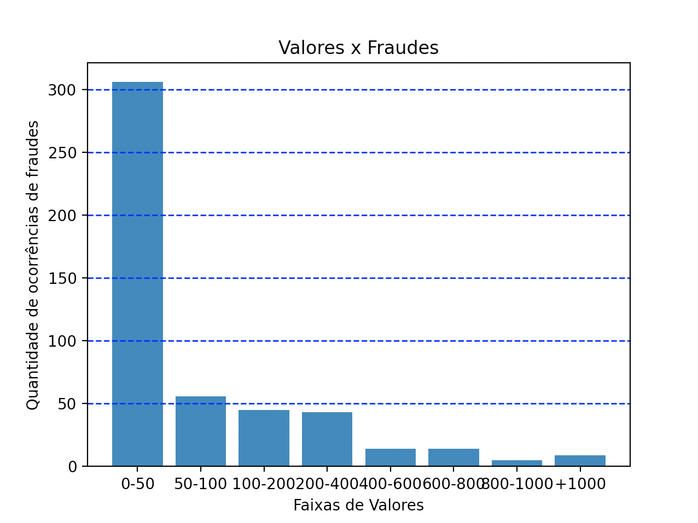
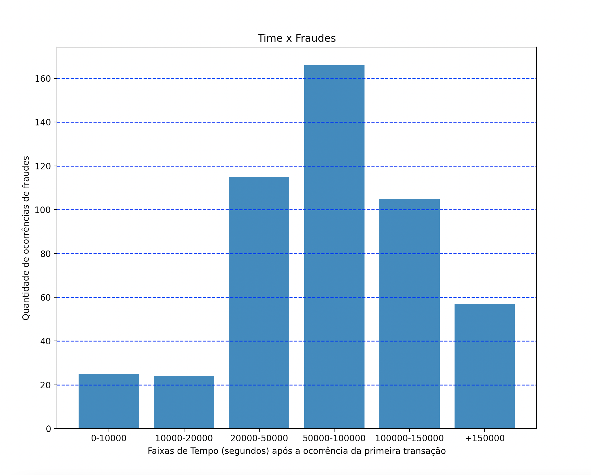
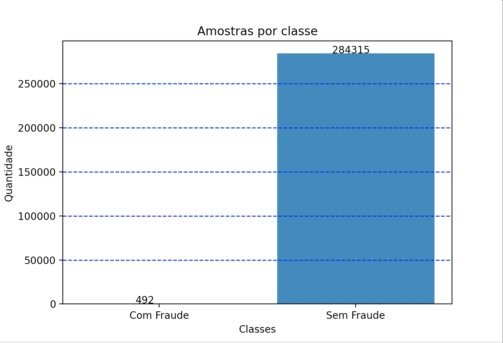

# CI1030_Bruno_Farias_20212
Repositório criado para as tarefas da disciplina Ciência de Dados para Segurança - UFPR - 2021-2
Bruno E. Farias - GRR20186715

### Tarefas
:point_right: [Tarefa 1](#tarefa-1)

:point_right: [Tarefa 2](#tarefa-2)

:point_right: [Tarefa 3](#tarefa-3)

:new: [Tarefa 4](#tarefa-4)

## Tarefa 1 :new:
Contador de pacotes/sessões de um arquivo .pcap.

:mag_right: [Ver arquivo conta_sessoes.py](tarefa1/conta_sessoes.py)

## Tarefa 2
.txt entregue na tarefa 2

:mag_right: [Ver arquivo Bruno_Farias.txt](tarefa2/Bruno_Farias.txt)

## Tarefa 3
:credit_card: Repositório: Fraudes em Cartões de Crédito https://www.kaggle.com/samkirkiles/credit-card-fraud/data

Dados:

:receipt: Quantidades de Amostras: 284.807

:arrow_right: Amostras COM Fraude: 492

:arrow_right: Amostras SEM Fraude: 284315

Classes:

:clock1230: Time: quantidade de tempo em segundos que passou desde a primeira transação.

:question: V1-V28: componentes obtidos com Análise de Componentes Principais (PCA - Principal Component Analysis) a respeito das transações. (O significado desses campos não é revelado por motivos de segurança).

:euro: Amount é a quantia de dinheiro envolvida na transação.

:warning: Class indica se houve fraude nessa transação (1 se houve, 0 caso contrário).

Scatterplot's:

:one:) Fraudes por Amostras: indica se houve fraude ou não ao longo das amostras

:two:) Valores por Fraudes: indica quantidade de frandes por faixa de valor fraudado

:three:) Tempo por Fraudes: indica quantidade de frandes por faixa de tempo de ocorrência da fraude

De maneira geral as amostras são distinguíveis, pois é possível analisar as transações que são fraudulentas,
o valor dessas fraudes, o timestamp que ocorreram as fraudes, etc...

Porém, como os significado dos valores V1 a V28 não são revelados, não é possível fazer análises a respeito
das variações dos valores dessas colunas.

:mag_right: [Ver arquivo tarefa3.py](tarefa3/tarefa3.py)

## Tarefa 4
Vetor de Características e Distribuição do conjunto de dados

Vetor de características: [‘Time’, 'V1', 'V2', 'V3', 'V4', 'V5', 'V6', 'V7', 'V8', 'V9', 'V10', 'V11', 'V12', 'V13', 'V14', 'V15', 'V16', 'V17', 'V18', 'V19', 'V20', 'V21', 'V22', 'V23', 'V24', 'V25', 'V26', 'V27', 'V28', 'Amount', ‘Class’]

É um problema binário: fraude ou não fraude

:mag_right: [Ver arquivo tarefa4.py](tarefa4/tarefa4.py)
:mag_right: [Ver relatório relatorio.pdf](tarefa4/relatorio.pdf)
