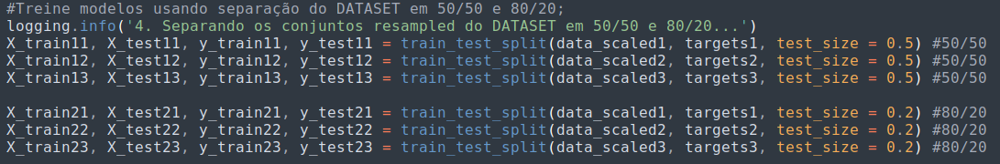

# CI1030_Bruno_Farias_20212
Repositório criado para as tarefas da disciplina Ciência de Dados para Segurança - UFPR - 2021-2
Bruno E. Farias - GRR20186715

### Tarefas
:point_right: [Tarefa 1](#tarefa-1)

:point_right: [Tarefa 2](#tarefa-2)

:point_right: [Tarefa 3](#tarefa-3)

:point_right: [Entrega da aula 8](#entrega-da-aula-8)

:point_right: [Tarefa 4](#tarefa-4)

:new: [Classificação / Tarefa Final](#classificação-Tarefa-Final)

## Tarefa 1 
Contador de pacotes/sessões de um arquivo .pcap.

:mag_right: [Ver arquivo conta_sessoes.py](tarefa1/conta_sessoes.py)

## Tarefa 2
.txt entregue na tarefa 2

:mag_right: [Ver arquivo Bruno_Farias.txt](tarefa2/Bruno_Farias.txt)

## Tarefa 3
:credit_card: Repositório: Fraudes em Cartões de Crédito https://www.kaggle.com/samkirkiles/credit-card-fraud/data

Dados:

:receipt: Quantidades de Amostras: 284.807

:arrow_right: Amostras COM Fraude: 492

:arrow_right: Amostras SEM Fraude: 284315

Classes:

:clock1230: Time: quantidade de tempo em segundos que passou desde a primeira transação.

:question: V1-V28: componentes obtidos com Análise de Componentes Principais (PCA - Principal Component Analysis) a respeito das transações. (O significado desses campos não é revelado por motivos de segurança).

:euro: Amount é a quantia de dinheiro envolvida na transação.

:warning: Class indica se houve fraude nessa transação (1 se houve, 0 caso contrário).

Scatterplot's:

:one:) Fraudes por Amostras: indica se houve fraude ou não ao longo das amostras

:two:) Valores por Fraudes: indica quantidade de frandes por faixa de valor fraudado

:three:) Tempo por Fraudes: indica quantidade de frandes por faixa de tempo de ocorrência da fraude

De maneira geral as amostras são distinguíveis, pois é possível analisar as transações que são fraudulentas,
o valor dessas fraudes, o timestamp que ocorreram as fraudes, etc...

Porém, como os significado dos valores V1 a V28 não são revelados, não é possível fazer análises a respeito
das variações dos valores dessas colunas.

:mag_right: [Ver arquivo tarefa3.py](tarefa3/tarefa3.py)

## Entrega da aula 8

Vetor de Características e Distribuição do conjunto de dados

Vetor de características: [‘Time’, 'V1', 'V2', 'V3', 'V4', 'V5', 'V6', 'V7', 'V8', 'V9', 'V10', 'V11', 'V12', 'V13', 'V14', 'V15', 'V16', 'V17', 'V18', 'V19', 'V20', 'V21', 'V22', 'V23', 'V24', 'V25', 'V26', 'V27', 'V28', 'Amount', ‘Class’]

É um problema binário: fraude ou não fraude

:mag_right: [Ver arquivo codigo.py](entrega_aula_8/codigo.py)
:mag_right: [Ver relatório relatorio.pdf](entrega_aula_8/relatorio.pdf)

## Tarefa 4

Cada aluno deverá apresentar o estado atual do seu projeto, mostrando e discutindo:

O dataset como um todo atributos, características, classes, amostrasdistribuição de classes
Processamento dos dados
Como foi feita a extração de características
Foi feito seleção?
Exploração e visualização de dados
Mostrar o diagrama de dispersão (scatterplot)
Mostrar visualmente o agrupamento de seu dataset com algum algoritmo de clustering
Sugestão: K-Means (mas pode usar outro, como DBScan)
Usar como número de cluster o número de classes do seu problema (se for binário, K=2)

:mag_right: [Ver arquivo clustering_v4.py](tarefa4/clustering_v4.py)
:mag_right: [Ver relatório Tarefa_4_bruno.pptx](tarefa4/Tarefa_4_bruno.pptx)

## Classificação Tarefa Final

:arrow_right: Separação do dataset em 80/20

80% - 227.845 amostras

20% - 56.962 amostras

:arrow_right: Dataset muito desbalanceado: criação de 3 conjuntos reamostrados com 1 amostra fraude para cada 5 não fraude

:arrow_right: Ajuste de limiar: descobrir os melhores parâmetros para Random Forest, KNN e SVM.

RF

KNN

SVM

:arrow_right: Treinar modelos: rodar os algorimos com os melhores parâmetros do ajuste para 50/50 e 80/20.

RF

Matriz de confusão 50/50 - Conjunto 3

Matriz de confusão 80/20 - Conjunto 3

KNN

Matriz de confusão 50/50 - Conjunto 3

Matriz de confusão 80/20 - Conjunto 3

SVM

Matriz de confusão 50/50 - Conjunto 3

Matriz de confusão 80/20 - Conjunto 3

:arrow_right: KNN

70% treino e 30% testes

5 vizinhos

tempo: 273 segundos

acurácia: 0.999

recall: 0.804

:mag_right: [Ver arquivo classification.py](classificacao/classification.py)

